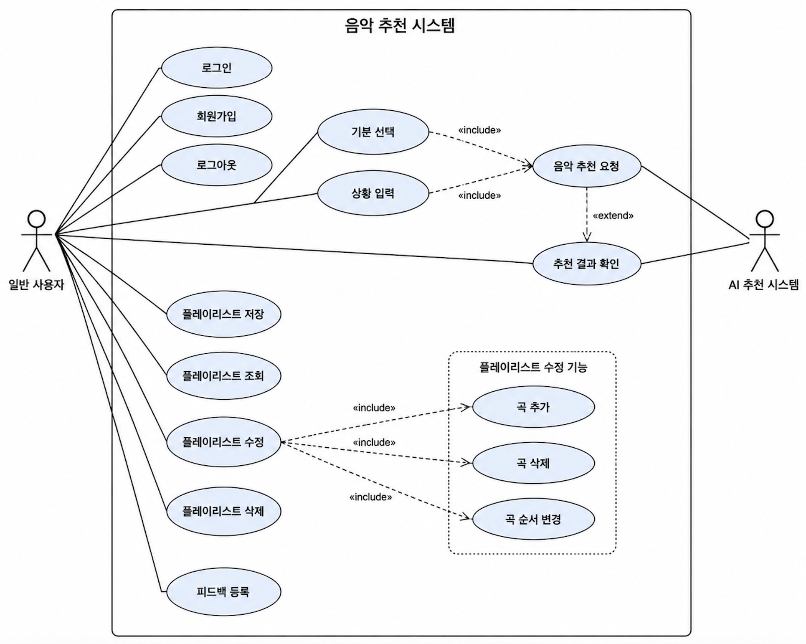

# 4차 회의 : 유스케이스

## 유스케이스

### 액터

- 일반 사용자
- AI 추천 시스템
### 유스케이스

- 로그인
- 회원가입
- 기분 선택
- 상황 입력
- 음악 추천 요청
- 추천 결과 확인
- 플레이리스트 저장
- 플레이리스트 조회
- 플레이리스트 수정
- 플레이리스트 삭제
- 곡 추가
- 곡 삭제
- 곡 순서 변경
- 피드백 등록
- 로그아웃
### 유스케이스 다이어그램

[file](../assets/notion/35e03f6ec32b805a9e58ecf3b5837890/36003f6ec32b80389339c1befedf01f4.pdf)

### 유스케이스 명세서

- 음악 추천 시스템 유스케이스 명세서
## TIL

유스케이스 작성하는 과정에서 2인 팀인지라 의사소통면에서 원활했다. 수업시간에 배웠을땐 유스케이스 명세에 대한 필요성을 실감하지 못하였지만, 직접 유스케이스를 분류하고, 다이어그램과 명세서 작성하는 과정을 겪어본 결과, 프로젝트 

오늘 소공 시간에 요구분석이랑 유스케이스 명세를 빡세게 작성해봤다. 솔직히 속으로는 '어차피 개발은 AI한테 바이브 코딩으로 맡길 건데 이렇게 구구절절 문서로 써야 하나?' 싶었다. 근데 막상 시나리오의 '기본 흐름'이랑 '대안 흐름'을 쪼개서 적다 보니까 깨달았다. 이거 완전 **AI한테 던져줄 완벽한 프롬프트**잖아? 예전에는 무지성으로 "플레이리스트 삭제 기능 만들어줘" 했다가 AI가 이상한 화면을 뱉어내서 다시 고치느라 핑퐁만 엄청 했는데, 이제는 이 명세서 내용 그대로 복붙해서 주면 예외 처리(모달창, 텅 빈 화면 등)까지 한 방에 기가 막히게 짜줄 것 같다. 바이브 코딩의 타율은 결국 내가 얼마나 요구사항을 디테일하게 말로 잘 묘사하느냐에 달려있다는 걸 느꼈다.

은서 :

소공 이론을 배우면서 유스케이스 명세를 작성했는데, 문서 작업하면서 머릿속엔 온통 '이거 빨리 정리하고 AI한테 코드 짜라고 시켜야지' 하는 생각뿐이었다. 하지만 막상 백엔드 통신 플로우(Spring ↔ FastAPI)랑 DB 상태 변화를 명세서로 쫙 정리해보니, 이 과정이 **바이브 코딩의 대참사를 막는 최소한의 방어막**이라는 걸 뼈저리게 체감했다. AI한테 대충 "음악 추천 API 만들어줘" 하면 지 멋대로 스키마 짜고 구조를 엉망으로 만들 텐데, 오늘 명확히 정의한 '시작/종료 조건'과 '에러 흐름'을 가이드라인으로 딱 쥐여주면 AI가 헛발질하는 걸 완벽하게 통제할 수 있겠다. 결국 기획과 설계가 탄탄해야 AI도 내 의도대로 조종할 수 있다는 걸 깨달았다.
